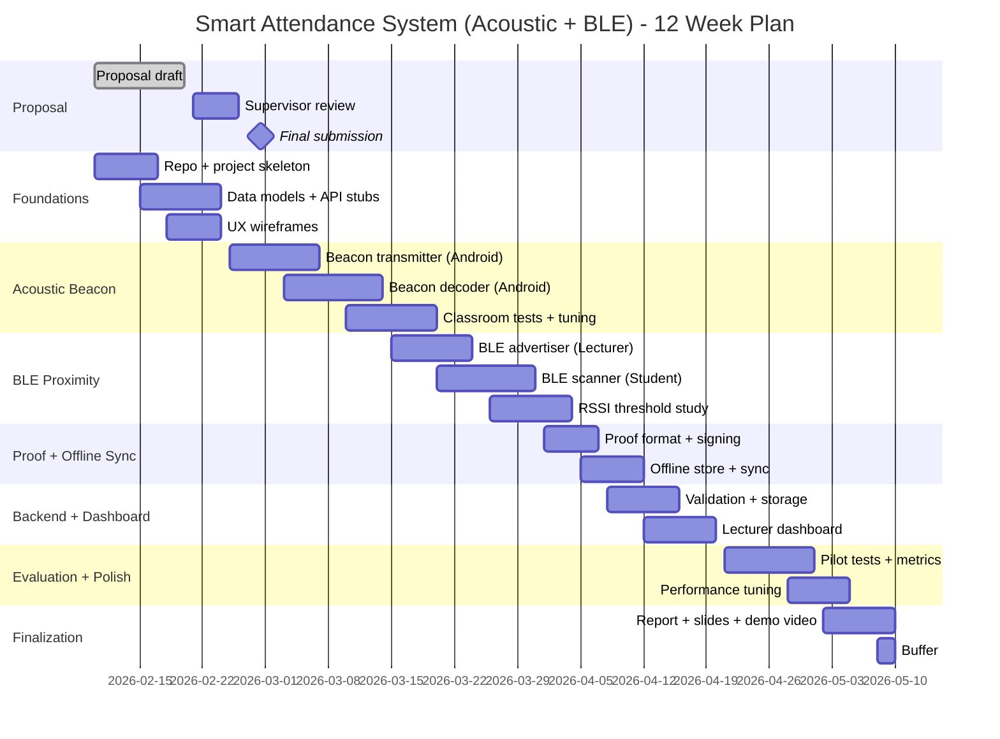

# Gantt Chart

```mermaid
gantt
    dateFormat  YYYY-MM-DD
    title Smart Attendance System (Acoustic + BLE) - 12 Week Plan

    section Proposal
    Proposal draft              :done, p1, 2026-02-10, 2026-02-20
    Supervisor review           :p2, 2026-02-21, 2026-02-26
    Final submission            :milestone, p3, 2026-02-28, 1d

    section Foundations
    Repo + project skeleton     :f1, 2026-02-10, 2026-02-17
    Data models + API stubs      :f2, 2026-02-15, 2026-02-24
    UX wireframes                :f3, 2026-02-18, 2026-02-24

    section Acoustic Beacon
    Beacon transmitter (Android) :a1, 2026-02-25, 2026-03-07
    Beacon decoder (Android)     :a2, 2026-03-03, 2026-03-14
    Classroom tests + tuning     :a3, 2026-03-10, 2026-03-20

    section BLE Proximity
    BLE advertiser (Lecturer)    :b1, 2026-03-15, 2026-03-24
    BLE scanner (Student)        :b2, 2026-03-20, 2026-03-31
    RSSI threshold study         :b3, 2026-03-26, 2026-04-04

    section Proof + Offline Sync
    Proof format + signing       :c1, 2026-04-01, 2026-04-07
    Offline store + sync         :c2, 2026-04-05, 2026-04-12

    section Backend + Dashboard
    Validation + storage         :d1, 2026-04-08, 2026-04-16
    Lecturer dashboard           :d2, 2026-04-12, 2026-04-20

    section Evaluation + Polish
    Pilot tests + metrics        :e1, 2026-04-21, 2026-05-01
    Performance tuning           :e2, 2026-04-28, 2026-05-05

    section Finalization
    Report + slides + demo video :f1, 2026-05-02, 2026-05-10
    Buffer                        :f2, 2026-05-08, 2026-05-10
```
