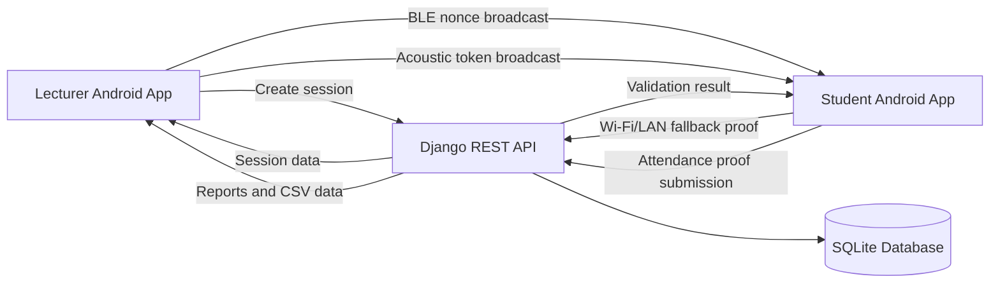
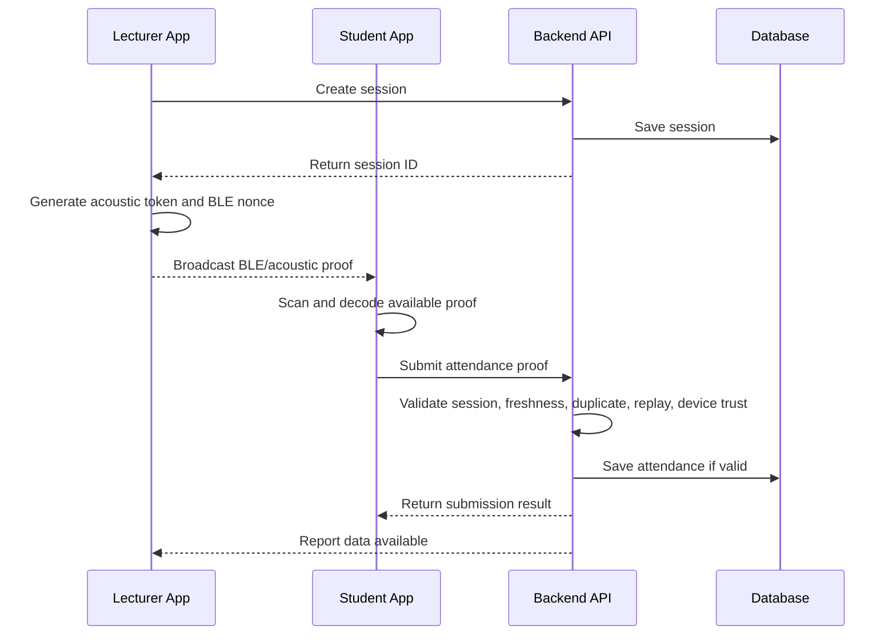

# Chapter Three: System Analysis and Design

## 3.1 Introduction

This chapter presents the methodology, system analysis, architecture, database design, validation model, and implementation plan for the smart attendance system. The system is designed to help lecturers create attendance sessions and allow students to submit attendance proof using proximity-based signals. The main proof channels are Bluetooth Low Energy (BLE) and acoustic beaconing. BLE is treated as the more practical classroom-range signal in the current prototype, while acoustic beaconing is treated as a short-range copresence signal. A Wi-Fi/LAN proof path is included only as a fallback for controlled classroom-network situations.

The design follows the central idea that attendance should not be accepted merely because a student is logged in. Instead, the system should validate identity, session status, proof freshness, device trust, and duplicate prevention on the backend. This approach reduces the risks associated with static QR codes, manual signing, and client-only validation.

## 3.2 Development Methodology

The project follows an Agile and iterative development approach. Agile development is suitable for this project because the system contains several interacting parts: a mobile application, a backend API, native Android acoustic processing, BLE advertising and scanning, device binding, Wi-Fi fallback, and attendance reporting. These parts required repeated testing, adjustment, and refinement as real-device limitations became clear.

The Agile approach is also suitable because the project evolved through practical feedback. For example, acoustic scanning was initially expected to provide wider coverage, but real device testing showed that it currently works best at short range. BLE performance also improved significantly after the correct Android permissions, including location and nearby-device permissions, were enabled. These findings required the system design to be adjusted so that BLE became the main practical proximity channel, acoustic became a short-range supplementary channel, and Wi-Fi/LAN became a fallback. This reflects the Agile principle of responding to change based on working software and feedback (Beck et al., 2001).

The development was divided into the following phases:

1. Requirement gathering and project scoping.
2. Backend setup for authentication, sessions, attendance proof, and reporting.
3. Flutter mobile app development for lecturer and student workflows.
4. Acoustic beacon transmission and microphone-based decoding.
5. BLE advertising and scanning for proximity verification.
6. Device ID binding and duplicate prevention.
7. Wi-Fi/LAN fallback proof implementation.
8. UI/UX improvement and error-message refinement.
9. APK testing on real Android devices.
10. Documentation and preparation for presentation.

## 3.3 Analysis of the Existing Attendance Process

The traditional classroom attendance process normally involves roll call, a paper attendance sheet, or manual signature collection. These methods are simple but have several weaknesses:

1. They consume lecture time, especially in large classes.
2. They require manual compilation after class.
3. They are vulnerable to proxy attendance.
4. They can be difficult to audit.
5. Paper records may be lost, damaged, or altered.

Some digital systems improve speed but still have limitations. A static QR code can be shared with absent students. A web form may be opened outside the classroom. RFID and biometric systems may require additional hardware, which increases deployment cost. Therefore, the proposed system is designed to use smartphones and short-lived proximity signals so that attendance proof is tied to a specific session and moment.

## 3.4 Proposed System Overview

The proposed system is a mobile and backend-based attendance platform. The lecturer creates a class session using the mobile app. The app generates session-specific proof signals and broadcasts them through BLE and acoustic sound. The student app scans for the available signal and submits the decoded proof to the backend. The backend validates the proof and stores the attendance record if it satisfies the required checks.

The system supports three attendance proof paths:

1. BLE proof: the student detects a session-specific BLE nonce from the lecturer device or future fixed beacon.
2. Acoustic proof: the student decodes a short acoustic token from the lecturer device speaker.
3. Wi-Fi/LAN fallback proof: the student submits a short proof while connected to the same local classroom network as the backend.

The Wi-Fi/LAN proof is not designed to replace BLE or acoustic proof. It is included to support controlled demonstrations and fallback conditions where BLE or acoustic scanning fails. The main proximity verification focus remains BLE and acoustic beaconing.

## 3.5 System Objectives

The system design is guided by the following objectives:

1. Allow lecturers to create and manage class attendance sessions.
2. Allow lecturer devices to broadcast session-specific BLE and acoustic signals.
3. Allow students to scan for attendance signals using Android devices.
4. Support Wi-Fi/LAN fallback only where controlled network verification is acceptable.
5. Prevent duplicate attendance submission for the same session.
6. Validate attendance proof on the backend instead of trusting the mobile client alone.
7. Bind a student account to a device ID to reduce account-sharing fraud.
8. Provide lecturer reports and CSV export for each session.
9. Provide clear permission and error messages to improve usability during real-device tests.

## 3.6 Functional Requirements

The functional requirements describe what the system must do.

| Requirement ID | Requirement |
| --- | --- |
| FR1 | The system shall allow users to register as students or lecturers. |
| FR2 | The system shall allow registered users to log in securely. |
| FR3 | The system shall allow lecturers to create attendance sessions. |
| FR4 | The system shall allow lecturers to start and stop attendance broadcast. |
| FR5 | The lecturer app shall generate short-lived acoustic and BLE session proof values. |
| FR6 | The student app shall scan for acoustic and BLE proof signals. |
| FR7 | The student app shall allow Wi-Fi/LAN fallback verification where enabled. |
| FR8 | The backend shall validate session identity and signal freshness. |
| FR9 | The backend shall prevent duplicate attendance for the same student and session. |
| FR10 | The backend shall bind a student account to a registered device ID. |
| FR11 | The lecturer shall be able to view attendance records for a selected session. |
| FR12 | The lecturer shall be able to export attendance records as CSV. |

## 3.7 Non-Functional Requirements

The non-functional requirements describe how the system should behave.

| Requirement ID | Requirement |
| --- | --- |
| NFR1 | The system should be easy for lecturers and students to use during class. |
| NFR2 | Attendance submission should be fast enough for classroom use. |
| NFR3 | The backend should validate critical attendance rules server-side. |
| NFR4 | Error messages should be understandable and not expose raw technical details. |
| NFR5 | The system should run on Android devices for the current prototype. |
| NFR6 | The system should support local network testing through an APK without USB debugging. |
| NFR7 | The design should allow future extension with fixed BLE beacons. |
| NFR8 | The system should minimize biometric and privacy-sensitive data in the current scope. |

## 3.8 System Architecture

The system uses a client-server architecture. The mobile app is the client, while the Django backend acts as the server. Native Android code is used where Flutter alone is not sufficient, especially for acoustic transmission/decoding and BLE advertising/scanning.

Figure 3.1 shows the high-level system architecture.



Figure 3.1: High-level system architecture.

The main components are:

1. Flutter mobile application: provides the lecturer and student user interfaces.
2. Android native layer: handles acoustic transmission, acoustic decoding, BLE advertising, BLE scanning, and permission checks.
3. Django REST backend: manages authentication, sessions, attendance proof validation, reports, and device binding.
4. SQLite database: stores users, sessions, attendance proofs, replay guards, and device trust data.

## 3.9 User Roles

The system has two main roles.

### 3.9.1 Lecturer

The lecturer can:

1. Register and log in.
2. Create a class session.
3. Start and stop attendance broadcast.
4. View live sessions.
5. Delete sessions where necessary.
6. View validation reports.
7. Export attendance records as CSV.

### 3.9.2 Student

The student can:

1. Register and log in.
2. Scan for attendance proof through BLE and acoustic channels.
3. Use Wi-Fi/LAN fallback where allowed.
4. Submit attendance proof.
5. View attendance history.
6. View profile and device information.

## 3.10 Attendance Proof Workflow

The attendance workflow begins when a lecturer creates a session. The session contains the course code, course title, lecturer name, room, start time, active status, and token version. Once the session is created, the lecturer starts broadcasting. The mobile app then generates short-lived proof values for the active session.

Figure 3.2 shows the attendance proof workflow.



Figure 3.2: Attendance proof workflow.

## 3.11 Acoustic Proof Design

The acoustic proof channel uses the lecturer device speaker and the student device microphone. The lecturer app transmits a session-specific token using Android native code. The student app records from the microphone and attempts to decode the token.

The acoustic payload contains:

1. Session ID.
2. Issued timestamp.
3. Challenge value.

The backend accepts the acoustic token only if:

1. The token format is valid.
2. The token session ID matches the selected attendance session.
3. The token is fresh within the allowed time window.
4. The token has not already been used in a replay attempt.

The acoustic channel is useful because it demonstrates signal encoding and decoding using commodity smartphone hardware. However, current testing shows that it should be treated as short-range proof. It is affected by noise, microphone sensitivity, speaker frequency response, and phone orientation. This is consistent with near-ultrasonic communication research, which shows that consumer hardware can exchange short tokens but that performance depends on hardware and environment (Getreuer et al., 2018; Jia et al., 2022).

## 3.12 BLE Proof Design

The BLE proof channel uses Bluetooth Low Energy advertising and scanning. The lecturer device advertises a short-lived nonce, and the student device scans for it. BLE does not require pairing between lecturer and student phones, which makes it suitable for classroom use.

The BLE payload contains:

1. Session ID.
2. Issued timestamp.
3. Nonce value.

The backend accepts the BLE proof only if:

1. The BLE nonce format is valid.
2. The nonce belongs to the selected session.
3. The nonce is fresh.
4. The nonce has not been reused.
5. The student has not already submitted attendance for the session.

BLE is treated as the main practical classroom-range signal in the current implementation. After enabling required permissions such as location and nearby-device access, BLE was detectable at a longer range than acoustic proof in real-device testing. This does not make BLE a perfect distance measurement tool. RSSI is known to vary due to obstacles, orientation, device hardware, and indoor multipath effects (Ramirez et al., 2021). Therefore, the system uses BLE as proximity evidence rather than exact positioning.

The design also allows future extension with fixed BLE beacons. A fixed beacon would not amplify the lecturer phone. Instead, it would act as another BLE broadcaster in the classroom. This is useful for larger classrooms because multiple beacons can be placed at strategic positions.

## 3.13 Wi-Fi/LAN Fallback Design

The Wi-Fi/LAN proof channel is included as a fallback. It is used when a student phone is on the same local classroom network as the backend. The student app generates a short Wi-Fi proof for the latest active session and submits it to the backend.

The backend accepts Wi-Fi/LAN proof only if:

1. The proof format is valid.
2. The proof belongs to the selected session.
3. The proof is fresh.
4. The request reaches the backend from a private local network address.
5. The normal authentication, duplicate-prevention, and device-trust rules pass.

Wi-Fi/LAN is not treated as a strong proximity technology because network signals can extend outside the exact room. Its purpose in this project is to provide a controlled fallback for demonstrations and exceptional cases where BLE or acoustic reception fails. It can also support APK testing without USB debugging.

## 3.14 Backend Validation Logic

The backend is responsible for final attendance validation. This is necessary because the mobile client can be modified or misused if all trust decisions are made locally.

The validation logic follows these steps:

```text
1. Confirm that the request is from an authenticated student.
2. Confirm that the selected session exists and is active.
3. Confirm that the submitted student ID matches the authenticated profile.
4. Confirm that the device ID is present.
5. Check device binding:
   - If the student has no registered device, bind the first submitted device.
   - If the device belongs to another student, reject the proof.
   - If the student already has a different registered device, reject the proof.
6. Parse acoustic, BLE, or Wi-Fi/LAN proof.
7. Confirm that at least one valid proof path exists.
8. Confirm that proof session ID matches the selected session.
9. Confirm that proof timestamp is fresh.
10. Check replay guard for acoustic/BLE proof.
11. Check that the student has not already submitted for the session.
12. Save attendance proof if all required checks pass.
```

This design supports automatic decision-making. The lecturer does not need to manually approve normal attendance records. Suspicious cases, such as device mismatch or duplicate submission, are rejected by the system.

## 3.15 Database Design

The database stores user profiles, sessions, attendance proofs, and replay guards. The main database entities are shown in Table 3.1.

| Entity | Purpose | Important Fields |
| --- | --- | --- |
| UserProfile | Stores student or lecturer profile data | user, role, matric_number, registered_device_id |
| Session | Stores class session data | course_code, course_title, lecturer_name, room, starts_at, active |
| AttendanceProof | Stores submitted attendance records | session, student_id, device_id, acoustic_token, ble_nonce, wifi_proof, rssi, observed_at |
| AttendanceReplayGuard | Prevents reuse of acoustic/BLE challenge values | session, challenge_token, ble_nonce, student_id |

Table 3.1: Main database entities.

The AttendanceProof entity has a unique constraint on session and student ID. This prevents one student from submitting more than one attendance proof for the same session. The AttendanceReplayGuard entity prevents old acoustic or BLE proof values from being reused.

## 3.16 Data Flow Design

The data flow has four main stages.

### 3.16.1 Registration and Authentication

Users register as either students or lecturers. Students provide a matric number, while lecturers provide a username. The backend stores authentication data and returns an access token after login.

### 3.16.2 Session Creation

The lecturer creates a session through the mobile app. The backend stores the session and returns the session ID. The lecturer can then start broadcasting proof signals.

### 3.16.3 Proof Capture and Submission

The student scans for acoustic and BLE signals or uses Wi-Fi/LAN fallback if necessary. The app fills the proof fields and submits them to the backend with the device ID and timestamp.

### 3.16.4 Report Generation

The lecturer retrieves records for the selected session. The report displays student details, course details, room, device ID, and scan mode. The lecturer can export the report as CSV.

## 3.17 Anti-Fraud Design

The anti-fraud design uses multiple layers rather than relying on one perfect control.

### 3.17.1 Device Binding

When a student submits attendance for the first time, the backend can bind the student account to that device ID. Future submissions must come from the registered device. This reduces the risk of a student logging into another student's account from a different phone.

Device binding does not solve every possible fraud scenario. For example, a student could physically carry a friend's phone to class. However, it reduces account-sharing fraud and creates an audit trail when one device is repeatedly used across accounts.

### 3.17.2 Duplicate Prevention

The backend enforces one attendance proof per student per session. This prevents repeated submissions and reduces confusion in the lecturer report.

### 3.17.3 Freshness Checks

Acoustic, BLE, and Wi-Fi proof values include timestamps. The backend rejects stale proof values. This reduces the risk of replaying an old broadcast.

### 3.17.4 Replay Guard

For acoustic and BLE proof, the backend stores used challenge or nonce values in a replay guard table. If the same value appears again, the system rejects it.

### 3.17.5 Permission Guidance

The Android app now prompts users for required runtime permissions before scan or broadcast. This is important because missing location or nearby-device permission can make BLE appear weak or unavailable. Android requires runtime approval for Bluetooth scan, advertise, and connect operations on newer versions (Android Developers, n.d.).

## 3.18 User Interface Design

The mobile app is designed around two user journeys: lecturer workflow and student workflow.

### 3.18.1 Lecturer Interface

The lecturer interface includes:

1. Session creation page.
2. Broadcast control button.
3. Live session page.
4. Attendance validation report.
5. CSV export option.
6. Profile page.

### 3.18.2 Student Interface

The student interface includes:

1. Signal scan page.
2. Acoustic/BLE scan button.
3. Wi-Fi/LAN fallback verification button.
4. Proof submission button.
5. Attendance history.
6. Profile and device information page.

The app gives clearer guidance when permissions are missing or when a signal is not detected. This improves usability during real classroom tests.

## 3.19 Software and Hardware Tools

The tools used in the project are listed in Table 3.2.

| Category | Tool |
| --- | --- |
| Mobile framework | Flutter |
| Native Android language | Kotlin |
| Backend framework | Django and Django REST Framework |
| Database | SQLite for prototype development |
| Mobile platform | Android |
| Communication channels | Acoustic signal, BLE, Wi-Fi/LAN |
| Version control | Git and GitHub |
| Development environment | Windows PC, Android phones |

Table 3.2: Development tools.

## 3.20 Testing Plan

The system will be evaluated using real Android devices. The testing plan includes:

1. Login and registration testing.
2. Lecturer session creation testing.
3. Acoustic scan testing at different distances.
4. BLE scan testing at different distances.
5. Permission-state testing for Bluetooth, location, and microphone.
6. Wi-Fi/LAN fallback testing on the same local network.
7. Duplicate submission testing.
8. Device binding and device mismatch testing.
9. CSV export testing.
10. Classroom-like noise and distance testing.

The final results will be reported in Chapter Four. Chapter Four should include measured distances, device models, room conditions, success/failure outcomes, and screenshots where necessary.

## 3.21 Ethical and Privacy Considerations

The current system avoids making facial recognition part of the main attendance submission flow. This reduces privacy and reliability concerns associated with camera quality, lighting, and biometric storage. The system stores device IDs for device-trust purposes, but these should be handled carefully because they relate to user identity and attendance behaviour.

For institutional deployment, the school should define clear policies for:

1. Who can view attendance records.
2. How long records are retained.
3. How device reset requests are handled.
4. How students are informed about device binding.
5. How exported CSV files are protected.

## 3.22 Summary

This chapter presented the system analysis and design of the smart attendance system. The design uses BLE as the main practical proximity channel, acoustic beaconing as a short-range copresence channel, and Wi-Fi/LAN as a minimal fallback. The backend validates attendance proof using session identity, freshness, duplicate prevention, replay protection, and device binding. The chapter also presented the architecture, user roles, proof workflow, database design, anti-fraud logic, user interface design, tools, and testing plan. Chapter Four will present implementation details, test results, and evaluation.
