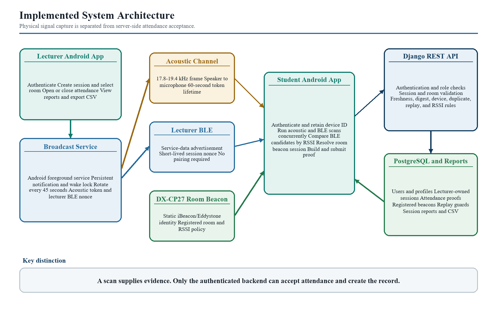
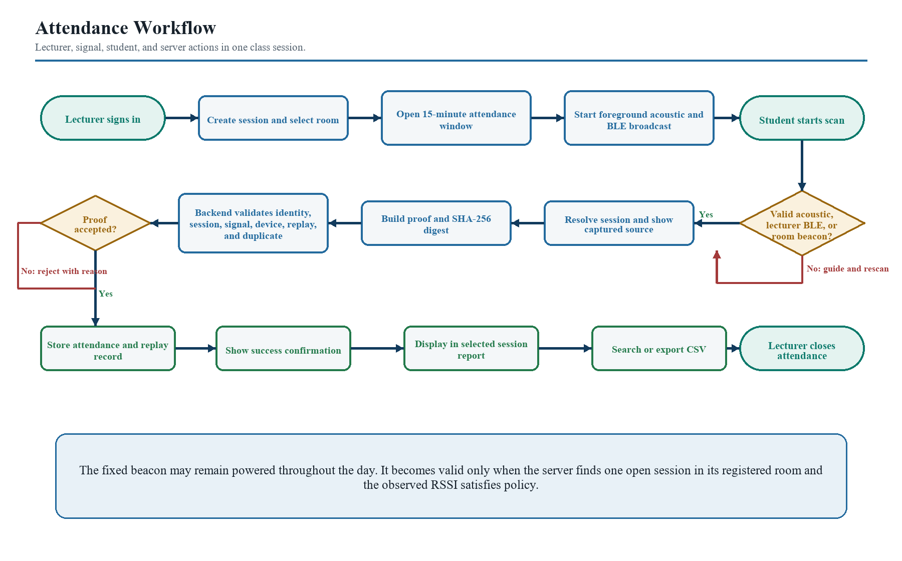
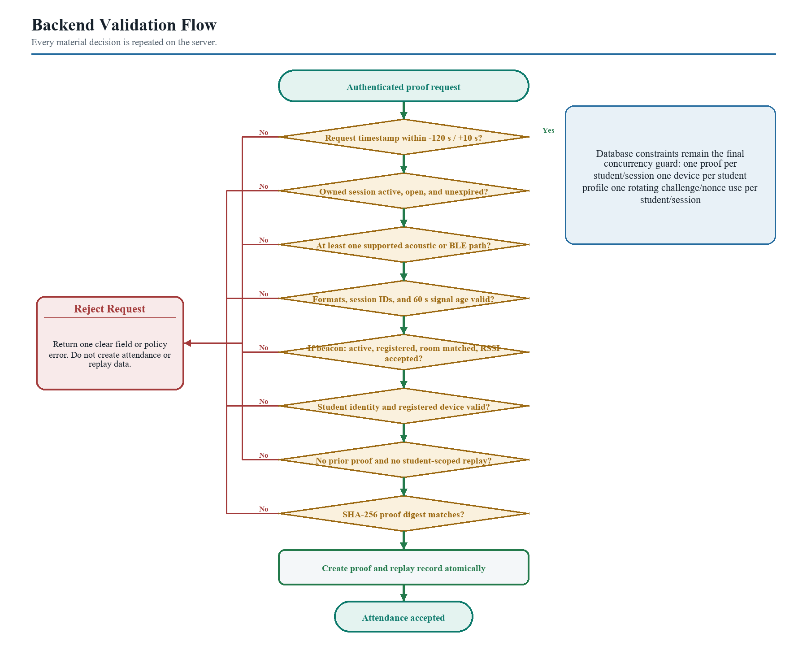
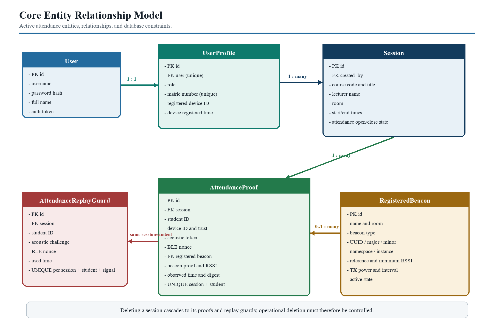

# Chapter Three: System Analysis and Design

## 3.1 Development Methodology

The system was developed with an iterative Agile approach. Agile was selected because the project combined a mobile interface, native Android services, acoustic signal processing, BLE communication, server-side validation, a relational database, deployment, and physical-device testing. These parts could not be evaluated adequately through a single sequential implementation. The Agile emphasis on working software and response to change allowed each increment to be tested before the next design decision was fixed (Beck et al., 2001).

The development process consisted of repeated cycles:

1. define the behaviour required for one workflow;
2. implement the mobile and backend components;
3. run focused automated checks;
4. test the feature on physical Android devices;
5. record the failure or usability problem;
6. revise the design; and
7. retain the verified implementation in version control.

This process materially changed the system. Acoustic signalling was initially expected to provide wider coverage, but device testing showed that the implemented decoder was dependable only at close range. BLE reception improved after the required Android permissions were handled correctly and consequently became the principal classroom mechanism. The DX-CP27 beacon was introduced as a room-specific BLE source, after which room assignment, beacon parsing, RSSI selection, and adjacent-room conflict rules were added.

The final implementation increment added a native Android foreground service, persistent notification, and partial wake lock so that a lecturer broadcast continues when the lecturer changes pages or locks the screen. This revision arose directly from physical use rather than from the original interface specification.

## 3.2 Analysis of the Existing Attendance Process

The existing manual process can be represented as follows:

1. the lecturer announces attendance;
2. students respond to roll call or sign a circulated register;
3. the lecturer or class representative checks the list;
4. the record is stored on paper or transferred to another system; and
5. attendance is later compiled for the course.

This process has four principal weaknesses. First, attendance collection competes with lecture time. Second, the record is vulnerable to proxy signing or response. Third, paper records require manual storage and compilation. Fourth, there is limited evidence linking the entry to a particular student, session, room, and time.

A basic web form improves storage but does not solve the evidence problem. A student outside the room can submit a shared link if the server only checks credentials. A static QR code or beacon identifier presents a similar weakness if it can be photographed, recorded, copied, or relayed. The proposed system therefore treats proximity capture and backend validation as separate stages.

## 3.3 Proposed System

The proposed system is a hosted client-server application with three operating roles: lecturer, student, and administrator. The lecturer and student use one Flutter Android application, while the role returned by the backend determines the portal shown after login. The administrator uses the Django administration interface.

The lecturer creates a session containing the course code, course title, room, and scheduled times. The backend supplies the lecturer name from the authenticated profile rather than trusting a typed name. When attendance is opened, the backend sets the opening time and a closing time 15 minutes later. Only one attendance session may be open for a room at a time.

The lecturer phone starts a foreground service that broadcasts acoustic and BLE evidence. The service generates new values every 45 seconds. Each generated acoustic token and BLE nonce remains acceptable for up to 60 seconds, giving a 15-second overlap for a scan or request in progress. The service continues across navigation and screen lock, but it stops when attendance is closed, the service is explicitly stopped, or the application task is removed.

The student initiates one scan operation. Acoustic capture and BLE scanning run concurrently to reduce waiting time. The app parses evidence from the lecturer phone and any supported room beacon. It compares valid BLE candidates by RSSI, resolves a fixed beacon to the currently open room session through the API, presents a concise result, and enables submission only when at least one acceptable path is available.

The student submits a proof containing the session, student identity, installation identifier, captured evidence, observed RSSI, observation time, and SHA-256 digest. The backend repeats all material checks and creates the attendance record within a database transaction.

*Figure 3.1. Implemented smart attendance system architecture.*

## 3.4 System Requirements

### 3.4.1 Functional Requirements

The functional requirements are grouped by role.

**Lecturer requirements**

1. register and authenticate as a lecturer;
2. create, update, select, and permanently delete an owned session;
3. select a room from registered beacon-room information;
4. open or close attendance for an owned session;
5. start and stop acoustic and lecturer-device BLE broadcasting;
6. retain broadcast operation while navigating within the app or locking the screen;
7. search sessions and attendance records;
8. view a session-specific attendance report; and
9. export the report as CSV.

**Student requirements**

1. register and authenticate with a unique matric number;
2. maintain one installation identifier across logout and subsequent login;
3. receive microphone, Bluetooth, nearby-device, and location guidance where required;
4. scan acoustic and BLE channels concurrently;
5. identify whether BLE evidence came from the lecturer phone, a room beacon, or both;
6. resolve a registered beacon to an open session in its assigned room;
7. review a clear successful or unsuccessful scan state;
8. submit no more than one attendance proof for a session; and
9. view attendance history and profile/device information.

**Administrator requirements**

1. manage users and profiles;
2. inspect sessions, proofs, replay records, and registered beacons;
3. configure beacon identity, room, RSSI threshold, transmit power, and interval;
4. reset a student's device binding through a controlled admin action; and
5. preserve submitted attendance and replay records as read-only audit data.

### 3.4.2 Non-Functional Requirements

**Security.** API operations require token authentication except registration, login, and health checking. Role and object ownership are enforced on the server. Production settings support HTTPS redirection, secure cookies, HTTP Strict Transport Security, and environment-managed secrets.

**Integrity.** The backend recomputes the proof digest and stores proof and replay records atomically. Database uniqueness constraints provide a final guard against duplicate attendance, shared device bindings, and repeated use of a rotating signal by one student.

**Usability.** The mobile interface uses role-specific navigation, concise status text, focused forms, searchable lists, expandable student rows, and recovery messages that do not expose exception traces.

**Availability.** The hosted API removes dependence on a changing local IP address. The free hosting tier may introduce a cold start and is treated as a development deployment rather than an institutional service-level guarantee.

**Compatibility.** The completed signal implementation targets Android. Layout tests use a 390 x 844 logical-pixel viewport to detect mobile overflow.

**Maintainability.** Mobile networking is centralised in a shared API client, proof formats are isolated in a codec, and server validation is concentrated in serializers and role-aware views. Database changes are versioned through Django migrations.

**Privacy.** The active API does not collect biometric evidence. Profile responses contain only the identity, role, and registered-device information required by the attendance workflow.

## 3.5 System Architecture

The architecture in Figure 3.1 contains five logical layers.

### 3.5.1 Presentation Layer

Flutter provides the authentication screen and the lecturer and student portals. The student portal contains Scan, History, and Profile destinations. The lecturer portal contains Session, Live, Reports, and Profile destinations. Navigation preserves the active student scan state, and lecturer broadcasting is not owned by a page widget.

### 3.5.2 Native Android Signal Layer

Flutter communicates with Kotlin code through a method channel. The native layer contains:

1. `AttendanceBroadcastService` for foreground operation and 45-second rotation;
2. `AcousticFrameEncoder` and `AcousticTransmitter` for PCM generation and playback;
3. `AcousticFrameDecoder` for microphone capture, filtering, guard detection, tone decisions, frame parsing, and diagnostics; and
4. `BleAdvertiser` for lecturer-device service-data advertising.

BLE scanning is performed through the Flutter BLE package because scan results must be integrated with Flutter state and the room-beacon parser.

### 3.5.3 Physical Signal Layer

Three physical observations are supported:

1. an acoustic frame emitted by the lecturer speaker;
2. a short-lived BLE service-data advertisement emitted by the lecturer phone; and
3. an iBeacon or Eddystone UID frame emitted by a fixed room beacon.

The first two carry session-specific rotating data. The room beacon carries a configured identity and depends on backend room/session validation.

### 3.5.4 API and Validation Layer

Django REST Framework exposes authentication, session, proof, room-beacon, report, export, and health endpoints. Token authentication identifies the account. Serializers parse and validate proof data, while views apply role, ownership, device-binding, room, and query-scope rules.

### 3.5.5 Data and Reporting Layer

The relational database stores users, profiles, sessions, proofs, registered beacons, and replay records. Lecturer queries are restricted to sessions created by that lecturer. Student history is restricted to the authenticated identity. Reports are filtered by the selected session, and CSV export contains serial number, student name, matric number, device identifier, and signal mode.

## 3.6 User Roles and Authorisation

### 3.6.1 Lecturer

A lecturer may create and manage only sessions associated with the lecturer profile. The name stored on a session is taken from the authenticated account. Another lecturer cannot update, delete, open, close, report on, or export that session. These controls are applied in the API and are not dependent on hidden interface buttons.

### 3.6.2 Student

A student may view only currently open sessions and the student's own proof history. The `student_id` in a proof must equal the matric number or username of the authenticated profile. The server does not permit a student to submit an arbitrary matric number.

### 3.6.3 Administrator

The administrator may configure operational records through Django admin. Proofs and replay records are read-only because modifying or deleting accepted evidence would weaken auditability. A device binding may be reset through a named administrative action when a legitimate replacement is approved.

## 3.7 Session Lifecycle

A session moves through the following states:

1. **Created:** the lecturer supplies course and room information; attendance is closed.
2. **Open:** the owner opens attendance; the backend records `attendance_opened_at` and computes `attendance_closes_at`.
3. **Broadcasting:** the Android foreground service transmits rotating evidence for that session.
4. **Closed:** the lecturer closes attendance or the configured 15-minute window expires.
5. **Inactive or deleted:** the lecturer may deactivate or permanently delete the owned session.

Before returning session or room data, the backend closes any record whose attendance closing time has passed. A room-conflict check prevents another session from opening in the same named room. A fixed beacon remains physically active, but it cannot resolve to a session before state 2 or after state 4.

*Figure 3.2. Lecturer broadcast, student scan, and proof-submission workflow.*

## 3.8 Acoustic Proof Design

### 3.8.1 Compact Token

The current acoustic token has the following form:

`ac2|session_base36|issued_epoch_base36|challenge`

Base-36 encoding shortens the session and timestamp fields. The challenge is an eight-character random string generated with `SecureRandom`. The token omits descriptive course data because the backend can retrieve that information from the session identifier.

### 3.8.2 Frame Encoding

The encoder uses binary frequency-shift keying. Its principal parameters are shown in Table 3.1.

**Table 3.1: Acoustic Encoder Parameters**

| Parameter | Implemented value |
| --- | --- |
| Sampling rate | 44,100 samples/s |
| Start guard | 17,800 Hz for 140 ms |
| Binary zero | 18,400 Hz |
| Binary one | 18,900 Hz |
| Stop guard | 19,400 Hz for 140 ms |
| Bit duration | 12 ms |
| Preamble | `10101010` |
| Length field | 8 bits |
| Integrity byte | XOR checksum |
| Amplitude coefficient | 0.42 |
| Frame repetitions | 5 |
| Inter-frame gap | 18 ms |

The encoder converts the UTF-8 token into bytes, prefixes the preamble and payload length, appends an XOR checksum, and generates a tapered sine wave for each bit. A four-millisecond amplitude ramp reduces abrupt edges at tone boundaries.

### 3.8.3 Decoding

The decoder records at 44.1 kHz for up to six seconds. A high-pass filter at 17.2 kHz and low-pass filter at 19.7 kHz isolate the intended band. Goertzel-style tone-energy measurements are evaluated in 12 ms windows. Start and stop guards, the preamble, length, payload, and checksum are then checked.

Diagnostics distinguish low ultrasonic energy, missing guards, ambiguous bit decisions, incomplete frames, and checksum failure. These messages support testing but are translated into concise user-facing guidance in the app.

The acoustic token is not accepted on local decode alone. The backend checks the encoded session, issue time, challenge, proof digest, authenticated student, session status, duplicate record, and replay record.

## 3.9 BLE Proof Design

### 3.9.1 Lecturer-Device BLE

The lecturer BLE value has the form:

`ble|session_id|issued_epoch|nonce`

It is placed in service data under the project service UUID. The foreground service rotates the nonce at the same 45-second interval as the acoustic challenge. The student parser validates the four fields and evaluates local freshness before enabling submission. The server enforces the 60-second signal lifetime independently.

### 3.9.2 Registered Room Beacon

Two beacon formats are supported:

`beacon|ibeacon|uuid|major|minor`

`beacon|eddystone_uid|namespace_id|instance_id`

The CP27 can expose several frames, but the project registers only the selected iBeacon or Eddystone UID identity. A `RegisteredBeacon` record stores the readable beacon name, room, format fields, reference RSSI, minimum accepted RSSI, transmit power, advertising interval, active state, and notes.

The fixed beacon does not carry a session nonce. A student first sends the observed beacon identity and RSSI to the resolve endpoint. The server finds a unique active beacon, confirms its room, closes expired sessions, and returns the one open session for that room. The final proof repeats the same identity so validation is not based only on the earlier lookup.

### 3.9.3 BLE Source Selection

The scanner collects nearby results for ten seconds, deduplicates advertisements, and identifies the strongest valid lecturer payload and strongest recognised beacon payload. Selection follows three cases:

1. if one source is at least 10 dB stronger, select that source;
2. if both are present within the 10 dB margin, retain both sources; or
3. if only one valid source is present, use that source.

The selected RSSI is the stronger observation. When both sources are retained, the final proof contains both the current lecturer nonce and beacon identity. The server validates each supplied source.

## 3.10 Proof Construction and Integrity

The student proof contains:

1. session identifier;
2. authenticated student identifier;
3. installation device identifier;
4. acoustic token, if captured;
5. lecturer BLE nonce, if captured;
6. room-beacon proof, if captured;
7. RSSI value;
8. beacon RSSI where available;
9. UTC observation time; and
10. SHA-256 digest.

The digest input is the pipe-separated sequence of session, student, device, acoustic token, BLE nonce, a reserved compatibility field, beacon proof, RSSI, and the exact observation-time string sent by the client. The backend reconstructs the same sequence and compares digests with a constant-time function.

This digest detects accidental corruption and simple field editing between proof construction and API validation. It is not a digital signature because no secret key is held in secure hardware on the client. A determined attacker who controls a modified client can recompute SHA-256. The decisive protections remain authenticated identity, session ownership, signal parsing, freshness, device binding, database constraints, and server policy.

## 3.11 Backend Validation Pipeline

The validation order is designed to reject invalid context before creating any record:

1. confirm that the request timestamp is no more than 120 seconds old and not more than 10 seconds in the future;
2. confirm that the session is active, open, owned by a lecturer, and within its closing time;
3. require at least one supported acoustic, lecturer BLE, or room-beacon source;
4. parse every supplied proof format;
5. compare the acoustic or lecturer BLE session identifier with the selected session;
6. enforce the 60-second lifetime for rotating signals;
7. resolve and validate a supplied fixed beacon, room, and RSSI;
8. compare submitted student identity with the authenticated account;
9. reject prior use of the same rotating challenge or nonce by that student in the session;
10. reject an existing attendance record for that student and session;
11. recompute the SHA-256 digest;
12. verify or bind the installation identifier; and
13. create the proof and replay record atomically.

The final uniqueness constraints handle requests that pass application checks concurrently. An integrity error is translated into an understandable duplicate/replay response.

*Figure 3.3. Server-side attendance proof validation pipeline.*

## 3.12 Device Binding and Fraud Controls

On first valid student use, the installation identifier may be bound to the profile. The database permits one non-empty identifier for only one student profile. The identifier is preserved when the user logs out; deleting it during logout would cause the legitimate installation to appear new at the next login. A second student cannot register or bind the same identifier.

Device binding addresses one scenario: a student logging into several accounts on the same application installation. It does not prevent a student from carrying a friend's already registered phone into class. It also does not equal Android hardware attestation. The report therefore describes device binding as a deterrent and trust signal, not as proof of personal identity.

Duplicate attendance is enforced by a unique pair of session and student. Replay constraints are deliberately student-scoped. Every student in a classroom may legitimately receive the same broadcast nonce, so a global uniqueness rule would accept only the first student. The implemented constraints instead prevent the same student from using the same acoustic challenge or BLE nonce twice within one session.

Other controls include lecturer ownership, one open session per room, fixed-beacon registration, minimum RSSI, signal expiry, proof digest, token revocation at logout, password validation, and read-only audit records.

## 3.13 Database Design

The core data model is shown in Figure 3.4 and summarised in Table 3.2.

*Figure 3.4. Core relational entities and cardinalities.*

**Table 3.2: Core Database Entities**

| Entity | Purpose | Selected fields and constraints |
| --- | --- | --- |
| User | Django authentication identity | username, password hash, full name, email, active/staff flags |
| UserProfile | Attendance role and device association | one-to-one user; role; unique matric number; one unique non-empty student device ID |
| Session | Lecturer-owned class and attendance state | course code/title; room; times; owner; open/close state; 15-minute window |
| AttendanceProof | Accepted attendance record | one record per session/student; signal fields; device trust; RSSI; observed and creation times |
| RegisteredBeacon | Fixed room-beacon configuration | iBeacon or Eddystone identity; room; minimum RSSI; transmit settings; active state |
| AttendanceReplayGuard | Student-scoped rotating-signal use | unique session/student/challenge and session/student/BLE nonce |
| Token | API authentication | one token associated with a signed-in user; revoked on logout |

The logical design presented in Figure 3.4 contains only the entities and fields used by the active attendance workflow. Historical migration compatibility does not alter the accepted acoustic and BLE proof paths.

## 3.14 Data Flows

### 3.14.1 Registration and Login

A registrant submits full name, role, identity, password, and installation identifier. Student matric numbers are normalised to uppercase and checked case-insensitively. Django password validators enforce the password policy. User and profile creation occur in a transaction. Login is case-insensitive, returns an API token and profile summary, and loads the role-specific portal.

### 3.14.2 Session Creation and Opening

The lecturer submits course and room data. The API records the authenticated lecturer as owner. On opening, the API checks room conflict, sets attendance times, and returns the session. The app then starts the foreground service with the first generated acoustic and BLE values.

### 3.14.3 Student Scan

The student app confirms required permissions and Bluetooth state. Acoustic and BLE scans run concurrently. Local parsing records diagnostic evidence. A fixed beacon is resolved through the backend because its frame does not contain a session. The app retrieves session metadata and enables submission only for a valid current path.

### 3.14.4 Submission and Reporting

The app constructs and posts the proof. On success, it records the session locally to prevent another immediate submission and displays a success confirmation. The backend remains the authoritative duplicate guard. The lecturer selects a session to view student rows and may expand a row for matric number, course, room, device, and scan mode before exporting CSV.

## 3.15 User Interface and Experience Design

The interface uses a restrained mobile visual language rather than decorative dashboards or promotional copy. It applies a consistent colour palette, typography hierarchy, spacing scale, status language, and bottom navigation. Content is centred within a maximum width so that the web build remains usable without turning the Android interface into a desktop-style page.

The lecturer session form requests only information the lecturer must provide. Lecturer name and token version are derived internally. Room selection uses known beacon rooms while allowing the course/session information to remain readable. Active broadcast status is presented in user terms rather than displaying raw nonce values.

The Live and Reports pages use search fields and compact one-line student/session rows. A student row expands on tap to show only the operational details requested for classroom use. This structure scales better than a large card for every student.

The student scan page separates action, evidence, and result. The principal action is a single scan button. Raw acoustic and BLE fields are not intended as manual inputs. A successful scan states the source and session; an unsuccessful scan gives one recovery action, such as enabling Bluetooth, granting permission, moving closer, or scanning again.

Error messages are mapped from network and API exceptions into short descriptions. Stack traces, socket exception text, and internal class names are not shown to users.

## 3.16 Deployment Design

The Android application uses `https://sa-acoustic-ble.onrender.com` as its default API. The value can still be replaced at build time through `API_BASE_URL` for controlled development, but the installed application does not expose an IP-address editor. This prevents stale LAN settings and removes the need to rebuild whenever a local address changes.

The Django service reads its secret key, debug state, allowed hosts, CSRF origins, database URL, and security settings from environment variables. Development uses SQLite. Hosted operation uses PostgreSQL. Static files are served through the deployment configuration, and a health endpoint allows the hosting platform or tester to confirm that the API is awake.

The shared mobile API client applies a 75-second timeout to tolerate a free-tier cold start and converts timeouts into understandable service-waking guidance. A logout request revokes the server token; local credentials are cleared even if the network is unavailable.

## 3.17 Software and Hardware Tools

**Table 3.3: Development and Test Tools**

| Category | Tool or component | Use |
| --- | --- | --- |
| Mobile framework | Flutter and Dart | Cross-platform UI, state, HTTP services, local storage |
| Android native layer | Kotlin | Foreground service, audio capture/playback, BLE advertising |
| Backend | Python, Django, Django REST Framework | Authentication, sessions, validation, reporting, admin |
| Database | SQLite and PostgreSQL | Local development and hosted relational storage |
| Hosting | Render | Public Django API deployment |
| Version control | Git and GitHub | Phase tracking, history, and remote backup |
| Lecturer test phone | Redmi 13C | Main acoustic and BLE broadcaster |
| Student test phones | POCO C71, Samsung A05, Vivo Y33 | Signal scanning and proof submission |
| Fixed beacon | DX-CP27 Mini | iBeacon/Eddystone room identity |

## 3.18 Verification Plan

Verification was divided into four levels.

**Backend API tests** cover authorisation, session ownership, room conflict, session expiry, valid and duplicate BLE proof, shared classroom nonce use by different students, digest tampering, identity mismatch, unsupported proof rejection, compact acoustic proof, beacon room and RSSI validation, ambiguous room state, unique device registration, profile privacy, and logout token revocation.

**Flutter tests** cover signed-out rendering, student and lecturer layouts at the test mobile viewport, and persistence of the installation identifier after logout.

**Native build verification** compiles the Android/Kotlin modules, foreground service, BLE advertiser, and acoustic components against the configured Android toolchain.

**Physical tests** cover registration, login, permission prompts, session creation, foreground broadcast, acoustic detection, BLE distance bands, obstacles, CP27 detection, proof submission, duplicate behaviour, hosted API wake-up, report display, and CSV export. Chapter Four reports only observations actually recorded during these tests.

## 3.19 Ethical, Privacy, and Security Considerations

The application stores identity, attendance, device association, session, and signal metadata. These records should be collected for attendance administration only and protected by role-based access. An institutional deployment should define retention periods, backup policy, device-change approval, breach response, and a process by which a student can query or correct an attendance record.

The active design avoids biometric collection. The installation identifier is shown in a shortened display form where a full identifier is unnecessary. The API uses HTTPS in hosted operation, passwords are hashed by Django, and secrets are supplied through the environment rather than committed to the repository.

No proximity method should be represented as infallible. BLE can cross room boundaries or be relayed, acoustic decoding can reject a present student, and a registered phone can be carried by another person. These limitations should be disclosed to users and considered in any disciplinary use of the records. Attendance evidence should support academic administration, not replace fair review of legitimate technical exceptions.

## 3.20 Summary

This chapter described the iterative method and the implemented architecture of the smart attendance system. The system separates signal capture from server acceptance, uses rotating lecturer acoustic and BLE evidence, supports a fixed beacon only within a registered room and open session, and applies identity, digest, freshness, duplicate, replay, device, ownership, and RSSI controls.

The design also addresses operational requirements that became visible during testing: concurrent scanning reduces wait time, a foreground service preserves lecturer broadcast across navigation and screen lock, compact reports support larger lists, and a hosted API removes dependence on a local address. Chapter Four evaluates the resulting implementation through automated checks and four-device physical observations.
